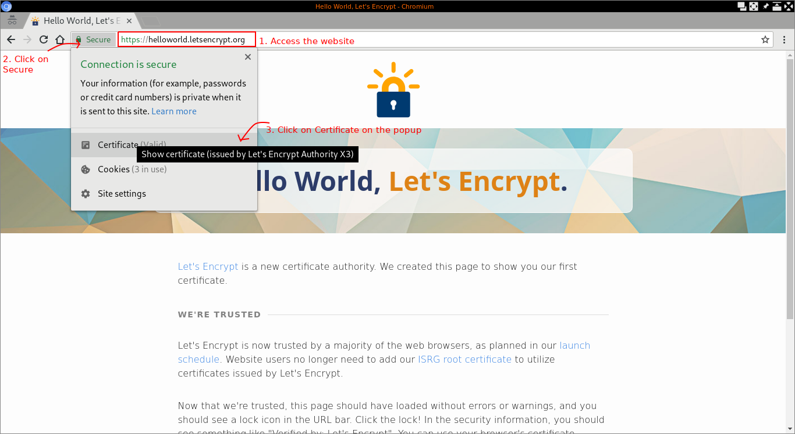
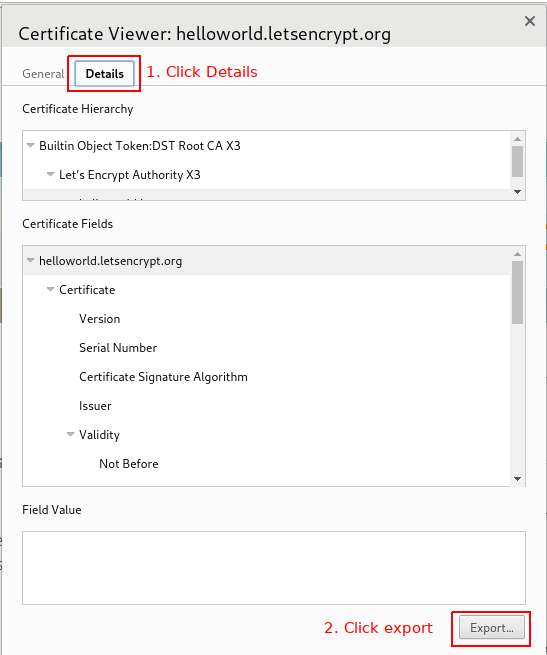

# SSL with Java

A common problem with Java applications occur because the JVM uses an independent repository of keys and certificates for SSL.

This means that older versions of Java do not have all CA's registered, which will cause the following error:

```
javax.net.ssl.SSLHandshakeException: sun.security.validator.ValidatorException: PKIX path building failed: sun.security.provider.certpath.SunCertPathBuilderException: unable to find valid certification path to requested target

	at sun.security.ssl.Alerts.getSSLException(Alerts.java:192)
	at sun.security.ssl.SSLSocketImpl.fatal(SSLSocketImpl.java:1884)
	at sun.security.ssl.Handshaker.fatalSE(Handshaker.java:276)
	at sun.security.ssl.Handshaker.fatalSE(Handshaker.java:270)
	at sun.security.ssl.ClientHandshaker.serverCertificate(ClientHandshaker.java:1341)
	at sun.security.ssl.ClientHandshaker.processMessage(ClientHandshaker.java:153)
	at sun.security.ssl.Handshaker.processLoop(Handshaker.java:868)
	at sun.security.ssl.Handshaker.process_record(Handshaker.java:804)
	at sun.security.ssl.SSLSocketImpl.readRecord(SSLSocketImpl.java:1016)
	at sun.security.ssl.SSLSocketImpl.performInitialHandshake(SSLSocketImpl.java:1312)
	at sun.security.ssl.SSLSocketImpl.startHandshake(SSLSocketImpl.java:1339)
	at sun.security.ssl.SSLSocketImpl.startHandshake(SSLSocketImpl.java:1323)
	at sun.net.www.protocol.https.HttpsClient.afterConnect(HttpsClient.java:563)
	at sun.net.www.protocol.https.AbstractDelegateHttpsURLConnection.connect(AbstractDelegateHttpsURLConnection.java:185)
	at sun.net.www.protocol.http.HttpURLConnection.getInputStream(HttpURLConnection.java:1300)
	at java.net.HttpURLConnection.getResponseCode(HttpURLConnection.java:468)
	at sun.net.www.protocol.https.HttpsURLConnectionImpl.getResponseCode(HttpsURLConnectionImpl.java:338)
	at xyz.luan.facade.Response.status(Response.java:56)
	at xyz.luan.facade.HttpFacadeSSLTest.testDisableSecurity(HttpFacadeSSLTest.java:28)
	at sun.reflect.NativeMethodAccessorImpl.invoke0(Native Method)
	at sun.reflect.NativeMethodAccessorImpl.invoke(NativeMethodAccessorImpl.java:57)
	at sun.reflect.DelegatingMethodAccessorImpl.invoke(DelegatingMethodAccessorImpl.java:43)
	at java.lang.reflect.Method.invoke(Method.java:606)
	at org.junit.runners.model.FrameworkMethod$1.runReflectiveCall(FrameworkMethod.java:50)
	at org.junit.internal.runners.model.ReflectiveCallable.run(ReflectiveCallable.java:12)
	at org.junit.runners.model.FrameworkMethod.invokeExplosively(FrameworkMethod.java:47)
	at org.junit.internal.runners.statements.InvokeMethod.evaluate(InvokeMethod.java:17)
	at org.junit.runners.ParentRunner.runLeaf(ParentRunner.java:325)
	at org.junit.runners.BlockJUnit4ClassRunner.runChild(BlockJUnit4ClassRunner.java:78)
	at org.junit.runners.BlockJUnit4ClassRunner.runChild(BlockJUnit4ClassRunner.java:57)
	at org.junit.runners.ParentRunner$3.run(ParentRunner.java:290)
	at org.junit.runners.ParentRunner$1.schedule(ParentRunner.java:71)
	at org.junit.runners.ParentRunner.runChildren(ParentRunner.java:288)
	at org.junit.runners.ParentRunner.access$000(ParentRunner.java:58)
	at org.junit.runners.ParentRunner$2.evaluate(ParentRunner.java:268)
	at org.junit.runners.ParentRunner.run(ParentRunner.java:363)
	at org.junit.runner.JUnitCore.run(JUnitCore.java:137)
	at com.intellij.junit4.JUnit4IdeaTestRunner.startRunnerWithArgs(JUnit4IdeaTestRunner.java:68)
	at com.intellij.rt.execution.junit.IdeaTestRunner$Repeater.startRunnerWithArgs(IdeaTestRunner.java:47)
	at com.intellij.rt.execution.junit.JUnitStarter.prepareStreamsAndStart(JUnitStarter.java:242)
	at com.intellij.rt.execution.junit.JUnitStarter.main(JUnitStarter.java:70)
Caused by: sun.security.validator.ValidatorException: PKIX path building failed: sun.security.provider.certpath.SunCertPathBuilderException: unable to find valid certification path to requested target
	at sun.security.validator.PKIXValidator.doBuild(PKIXValidator.java:385)
	at sun.security.validator.PKIXValidator.engineValidate(PKIXValidator.java:292)
	at sun.security.validator.Validator.validate(Validator.java:260)
	at sun.security.ssl.X509TrustManagerImpl.validate(X509TrustManagerImpl.java:326)
	at sun.security.ssl.X509TrustManagerImpl.checkTrusted(X509TrustManagerImpl.java:231)
	at sun.security.ssl.X509TrustManagerImpl.checkServerTrusted(X509TrustManagerImpl.java:126)
	at sun.security.ssl.ClientHandshaker.serverCertificate(ClientHandshaker.java:1323)
	... 36 more
Caused by: sun.security.provider.certpath.SunCertPathBuilderException: unable to find valid certification path to requested target
	at sun.security.provider.certpath.SunCertPathBuilder.engineBuild(SunCertPathBuilder.java:196)
	at java.security.cert.CertPathBuilder.build(CertPathBuilder.java:268)
	at sun.security.validator.PKIXValidator.doBuild(PKIXValidator.java:380)
	... 42 more
```

To solve this, you need to download the certificate and add it to HttpFacade; there are two steps.

First, download the certificate using your browser. E.g. for Chromium (the procedure for Firefox is very similar):

<p align="center">
    
</p>

<p align="center">
    
</p>

Finally, click Export and then save the file somewhere, keeping note of the name.

Normally you would want to have it in your project resources folder (you need to commit that to version control).

You can save it as `org.letsencrypt.cer`, or something like that.

Next step is to import the file in your Façade:

```java
    Response r = new HttpFacade("https://helloworld.letsencrypt.org/")
        .addCustomCertificate(HttpFacadeTest.class.getResourceAsStream("/org.letsencrypt.cer"))
        .get();
```

And done! This solution will work on AppEngine as well.

In the particular case of Let's Encrypt, the newer versions of JDK 8 have the certificate by default. But AppEngine older versions or other newer sites might cause problems.

There is also a way to disable SSL validation altogether; however, you should never, never ever do that, because it will make your request totally insecure and vulnerable. If you really know what you are doing, check the comments on the method `disableSecuritySSLCertificateValidation` of HttpFacade for more details.
